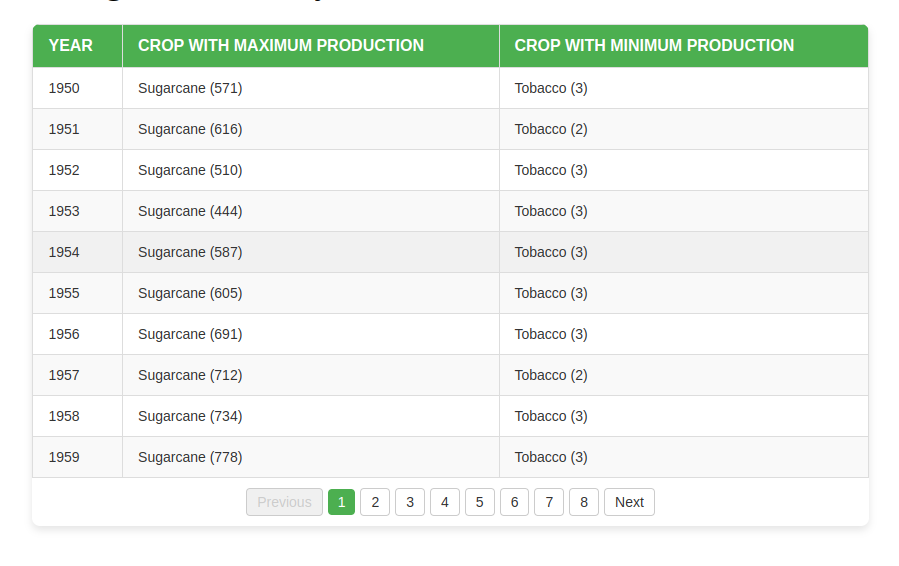
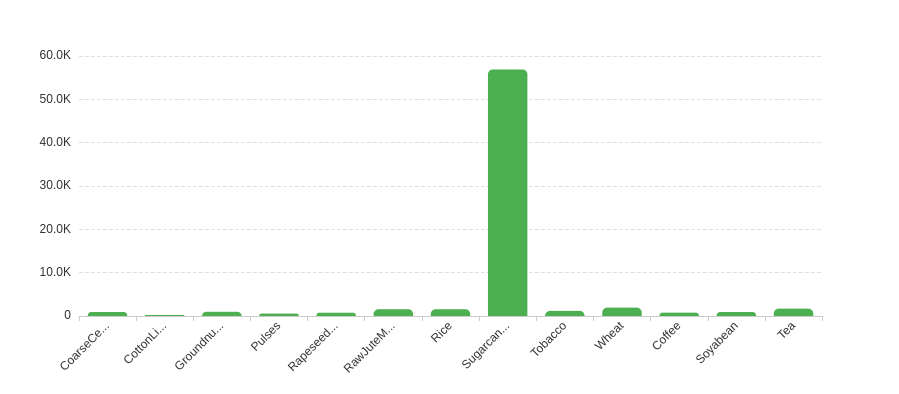

# Indian Agriculture Analysis

This project provides insights into Indian agricultural production and yield statistics using a simple Vite + React application. The app displays a table of crops with maximum and minimum production for each year and a bar chart showing the average yield for each crop.

---

## Table of Contents

1. [Overview](#overview)
2. [Features](#features)
3. [Tech Stack](#tech-stack)
4. [Setup Instructions](#setup-instructions)
5. [Screenshots](#screenshots)
6. [Folder Structure](#folder-structure)

---

## 1. Overview

This app processes agricultural data and visualizes it in an interactive table and chart. The data is extracted from a JSON file and dynamically processed to calculate:

- Maximum and minimum crop production for each year.
- Average yield of each crop.

---

## 2. Features

- **Interactive Table**: Displays maximum and minimum crop production for each year.
- **Bar Chart**: Visualizes the average yield of crops.
- **Responsive Design**: Ensures compatibility across all devices.
- **Pagination**: Handles large datasets with paginated tables.

---

## 3. Tech Stack

- **Frontend**:
  - Vite
  - React
  - TypeScript
  - ECharts
  - Mantine (UI components)
- **Data**:
  - Processed from JSON files.

---

## 4. Setup Instructions

### 1. Clone the Repository

```bash
git clone https://github.com/your-username/indian-agriculture-analysis.git
cd indian-agriculture-analysis
```

### 2. Install Dependencies

```bash
yarn install
```

### 3. Start the Application

```bash
yarn dev
```

The application will run at http://localhost:5173.

### 4. Build for Production

```bash
yarn build
```

---

## 5. Screenshots

### 1. Table - Maximum and Minimum Crop Production



### 2. Bar Chart - Average Crop Yield



## 6. Folder Structure

```bash
src
├── assets              # Static assets like JSON data and screenshots
│   ├── fakeJson
│   │   └── agroAnalysis.json
│   ├── readme
│   │   ├── table.png
│   │   └── chart.png
├── components          # Reusable components
│   ├── chart
│   │   └── BarChart.tsx
│   ├── table
│   │   └── Table.tsx
├── types               # TypeScript type definitions
│   └── dataTypes.ts
├── utils               # Utility functions
│   └── dataParser.ts
├── styles              # Global styles
│   └── Chart.css
│   └── Table.css
├── App.tsx             # Main application entry point
├── main.tsx            # Vite React DOM rendering
├── vite.config.ts      # Vite configuration

```
